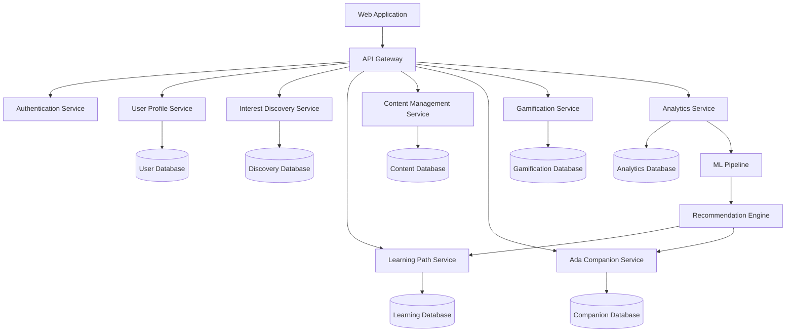

# Design Document: Ada - Your Coding Companion

## Overview

Ada is a personalized learning platform that combines adaptive learning technology with gamification and AI companion interaction to create an engaging coding education experience. The system uses machine learning to analyze user behavior and preferences, creating tailored learning paths that adapt in real-time based on performance and engagement patterns.

The platform architecture follows a modular design with distinct components for user modeling, content adaptation, gamification, and companion interaction. This separation enables independent scaling and maintenance while ensuring seamless integration of all features.

Key design principles:

- **Personalization-first**: Every interaction adapts to the individual user's interests, learning style, and progress
- **Engagement through gamification**: Meaningful game elements that connect to learning outcomes rather than arbitrary rewards
- **Supportive companion**: Ada maintains a consistent, encouraging personality that celebrates achievements and provides guidance
- **Progressive disclosure**: Content complexity increases gradually based on demonstrated mastery
- **Data-driven adaptation**: Continuous learning from user interactions to improve personalization

## Architecture

The system follows a microservices architecture with the following core services:



### Service Responsibilities

**API Gateway**: Routes requests, handles authentication, rate limiting, and request/response transformation

**User Profile Service**: Manages user accounts, preferences, learning history, and profile data synchronization

**Interest Discovery Service**: Conducts interactive assessments, analyzes responses, and generates interest profiles

**Learning Path Service**: Creates personalized curricula, adapts content difficulty, and tracks learning progress

**Content Management Service**: Stores and serves learning modules, exercises, projects, and multimedia content

**Ada Companion Service**: Generates personalized messages, maintains conversation context, and adapts communication style

**Gamification Service**: Manages points, badges, achievements, streaks, and progress visualization

**Analytics Service**: Collects user interaction data, generates insights, and feeds the ML pipeline

**ML Pipeline**: Processes behavioral data to improve personalization algorithms and content recommendations

## Components and Interfaces

### Interest Discovery Engine

The Interest Discovery Engine conducts interactive assessments to understand user motivations and preferences.

**Core Components:**

- **Question Generator**: Creates engaging, conversational questions based on user responses
- **Response Analyzer**: Uses natural language processing to extract interests and learning preferences
- **Profile Builder**: Constructs comprehensive interest profiles with confidence scores
- **Adaptation Engine**: Modifies question flow based on user engagement and response patterns

**Key Interfaces:**

```typescript
interface InterestProfile {
  userId: string;
  interests: InterestArea[];
  learningStyle: LearningStyle;
  motivations: Motivation[];
  confidenceScores: Record<string, number>;
  lastUpdated: Date;
}

interface InterestArea {
  category: string;
  subcategories: string[];
  strength: number; // 0-1 scale
  curiosityLevel: number; // 0-1 scale
}

interface DiscoveryQuestion {
  id: string;
  type: "multiple_choice" | "ranking" | "scenario" | "open_ended";
  content: string;
  options?: string[];
  followUpLogic: FollowUpRule[];
}
```

### Learning Path Generator

The Learning Path Generator creates and adapts personalized learning sequences based on user profiles and progress.

**Core Components:**

- **Curriculum Engine**: Maps interests to relevant coding concepts and projects
- **Difficulty Adapter**: Adjusts content complexity based on demonstrated mastery
- **Progress Tracker**: Monitors completion rates, time spent, and engagement metrics
- **Path Optimizer**: Reorders content based on learning effectiveness and user preferences

**Key Interfaces:**

```typescript
interface LearningPath {
  userId: string;
  pathId: string;
  title: string;
  description: string;
  modules: LearningModule[];
  estimatedDuration: number;
  difficultyLevel: DifficultyLevel;
  adaptationHistory: AdaptationEvent[];
}

interface LearningModule {
  moduleId: string;
  title: string;
  type: "concept" | "exercise" | "project" | "assessment";
  prerequisites: string[];
  learningObjectives: string[];
  content: ModuleContent;
  adaptiveElements: AdaptiveElement[];
}

interface AdaptationEvent {
  timestamp: Date;
  trigger: "performance" | "engagement" | "time_spent" | "user_feedback";
  action:
    | "difficulty_increase"
    | "difficulty_decrease"
    | "content_reorder"
    | "additional_support";
  impact: string;
}
```

### Ada Companion System

The Ada Companion System provides personalized encouragement, guidance, and celebration throughout the learning journey.

**Core Components:**

- **Personality Engine**: Maintains consistent character traits while adapting to user communication preferences
- **Message Generator**: Creates contextual responses based on user progress, achievements, and emotional state
- **Celebration Orchestrator**: Triggers appropriate celebrations for different types of achievements
- **Guidance Provider**: Offers hints and alternative explanations without revealing solutions

**Key Interfaces:**

```typescript
interface CompanionPersonality {
  traits: PersonalityTrait[];
  communicationStyle: CommunicationStyle;
  adaptationRules: AdaptationRule[];
  emotionalIntelligence: EmotionalResponse[];
}

interface PersonalityTrait {
  name: string;
  intensity: number; // 0-1 scale
  contexts: string[]; // When this trait is most prominent
}

interface CompanionMessage {
  messageId: string;
  userId: string;
  context: MessageContext;
  content: string;
  emotionalTone: EmotionalTone;
  personalizations: Personalization[];
  timestamp: Date;
}

interface MessageContext {
  trigger:
    | "achievement"
    | "struggle"
    | "milestone"
    | "question"
    | "celebration";
  userState: UserState;
  recentActivity: Activity[];
  progressMetrics: ProgressMetrics;
}
```

### Gamification Engine

The Gamification Engine manages motivational elements that connect meaningfully to learning outcomes.

**Core Components:**

- **Points System**: Awards points for effort, completion, and quality of work
- **Badge Manager**: Creates and awards badges for specific achievements and skill demonstrations
- **Streak Tracker**: Monitors learning consistency and provides streak-based rewards
- **Progress Visualizer**: Creates compelling visual representations of user advancement

**Key Interfaces:**

```typescript
interface GamificationProfile {
  userId: string;
  totalPoints: number;
  level: number;
  badges: Badge[];
  streaks: Streak[];
  achievements: Achievement[];
  progressVisualization: ProgressData;
}

interface Badge {
  badgeId: string;
  name: string;
  description: string;
  category: BadgeCategory;
  requirements: Requirement[];
  rarity: "common" | "uncommon" | "rare" | "epic" | "legendary";
  earnedDate?: Date;
  progressTowards?: number; // 0-1 scale for partially completed badges
}

interface Streak {
  type: "daily_learning" | "problem_solving" | "project_completion";
  currentCount: number;
  bestCount: number;
  lastActivity: Date;
  rewards: StreakReward[];
}
```

## Data Models

### User Profile Model

```typescript
interface UserProfile {
  userId: string;
  email: string;
  displayName: string;
  avatar?: string;
  createdAt: Date;
  lastActive: Date;

  // Learning preferences
  learningStyle: LearningStyle;
  preferredPace: "slow" | "moderate" | "fast";
  difficultyPreference: "gradual" | "challenging";

  // Interest and motivation data
  interestProfile: InterestProfile;
  goals: LearningGoal[];
  motivations: Motivation[];

  // Progress tracking
  currentLearningPath?: string;
  completedModules: string[];
  skillsAcquired: Skill[];
  timeInvested: number; // minutes

  // Personalization data
  adaPersonalization: CompanionPreferences;
  gamificationPreferences: GamificationPreferences;

  // Privacy and settings
  privacySettings: PrivacySettings;
  notificationPreferences: NotificationPreferences;
}
```

### Learning Content Model

```typescript
interface LearningContent {
  contentId: string;
  title: string;
  description: string;
  type: ContentType;
  difficulty: DifficultyLevel;
  estimatedDuration: number;

  // Content structure
  sections: ContentSection[];
  exercises: Exercise[];
  assessments: Assessment[];

  // Adaptive elements
  prerequisites: Prerequisite[];
  learningObjectives: LearningObjective[];
  adaptiveHints: AdaptiveHint[];

  // Metadata
  tags: string[];
  interestAreas: string[];
  skillsTargeted: string[];
  createdAt: Date;
  updatedAt: Date;

  // Analytics
  completionRate: number;
  averageRating: number;
  engagementMetrics: EngagementMetrics;
}
```

### Progress Tracking Model

```typescript
interface UserProgress {
  userId: string;
  contentId: string;

  // Progress metrics
  status: "not_started" | "in_progress" | "completed" | "mastered";
  completionPercentage: number;
  timeSpent: number; // minutes
  attempts: number;

  // Performance data
  scores: Score[];
  mistakes: Mistake[];
  breakthroughs: Breakthrough[];

  // Engagement data
  engagementLevel: number; // 0-1 scale
  frustrationIndicators: FrustrationIndicator[];
  flowStateIndicators: FlowStateIndicator[];

  // Timestamps
  startedAt: Date;
  lastActivity: Date;
  completedAt?: Date;

  // Adaptive responses
  adaptationsTriggered: AdaptationEvent[];
  personalizedContent: PersonalizedContent[];
}
```

Now I need to use the prework tool to analyze the acceptance criteria before writing the Correctness Properties section.

<function_calls>
<invoke name="prework">
<parameter name="featureName">ada-coding-companion

## Correctness Properties

_A property is a characteristic or behavior that should hold true across all valid executions of a system—essentially, a formal statement about what the system should do. Properties serve as the bridge between human-readable specifications and machine-verifiable correctness guarantees._

Based on the prework analysis, the following properties ensure Ada's correctness across all user interactions:

### Property 1: Interest Discovery Completeness

_For any_ new user account, the Interest Discovery Engine should present discovery questions and generate a complete interest profile with all required fields (interests, learning style, motivations, confidence scores) upon completion.
**Validates: Requirements 1.1, 1.2, 1.3**

### Property 2: Discovery Profile Preservation

_For any_ user retaking the discovery assessment, the system should update the interest profile while preserving all existing learning progress, completed modules, and earned achievements.
**Validates: Requirements 1.4**

### Property 3: Learning Path Generation Consistency

_For any_ valid interest profile, the Learning Path Generator should create a tailored learning sequence that contains both technical coding skills and interest-specific applications, organized in progressive modules with proper prerequisite relationships.
**Validates: Requirements 2.1, 2.2, 2.3**

### Property 4: Adaptive Learning Response

_For any_ user performance data indicating struggle or mastery, the Adaptive Learning System should trigger appropriate content adjustments (difficulty changes, additional support, or pacing modifications) that align with the detected learning state.
**Validates: Requirements 2.4, 8.2, 8.3**

### Property 5: Path Selection Availability

_For any_ user interest profile that matches multiple learning paths, the system should present all available options for user selection with preview capabilities.
**Validates: Requirements 2.5**

### Property 6: Ada Companion Contextual Response

_For any_ user interaction event (completion, struggle, milestone, question), Ada should generate appropriate contextual responses that maintain consistent personality traits while adapting to the user's communication preferences and providing guidance that encourages exploration rather than direct answers.
**Validates: Requirements 3.1, 3.2, 3.3, 3.4, 3.5**

### Property 7: Gamification Reward Consistency

_For any_ user learning activity, milestone achievement, or consistent behavior pattern, the Gamification Engine should award appropriate rewards (points, badges, streak increments) that correspond to the type and quality of the accomplishment.
**Validates: Requirements 4.1, 4.2, 4.3**

### Property 8: Progress Visualization Accuracy

_For any_ user's learning data, the progress tracking system should accurately display advancement, skills developed, time invested, and goals achieved across all dashboard and profile views.
**Validates: Requirements 4.4, 4.5, 6.1**

### Property 9: Interactive Learning Module Provision

_For any_ learning module access, the system should present interactive coding exercises with real-time feedback, solution validation, and constructive improvement suggestions.
**Validates: Requirements 5.1, 5.2, 5.3**

### Property 10: Project Scaffolding Balance

_For any_ project-based learning activity, the system should provide hints and scaffolding that guide learning without revealing complete solutions, and showcase completed work with real-world connections.
**Validates: Requirements 5.4, 5.5**

### Property 11: User Preference Management

_For any_ user preference modification (pace, difficulty, communication style, interests), the system should properly save, apply, and suggest related learning opportunities based on the updated preferences.
**Validates: Requirements 6.2, 6.3**

### Property 12: Behavioral Learning Integration

_For any_ user engagement pattern over time, the system should demonstrate improved personalization through refined content recommendations, optimized study schedules, and adapted presentation styles.
**Validates: Requirements 6.4, 8.1, 8.4, 8.5**

### Property 13: Privacy Control Enforcement

_For any_ user privacy setting configuration, the system should enforce data sharing restrictions and profile visibility controls across all sharing and showcase features.
**Validates: Requirements 6.5, 7.5**

### Property 14: Achievement Celebration Context

_For any_ significant milestone or achievement unlock, the system should provide personalized celebration sequences with meaningful context about the accomplishment's connection to user goals and real-world career applications.
**Validates: Requirements 7.1, 7.2, 7.4**

### Property 15: Consistency Recognition

_For any_ user demonstration of learning consistency or streak building, the system should provide appropriate acknowledgments that recognize dedication and encourage continued engagement.
**Validates: Requirements 7.3**

### Property 16: Data Persistence and Synchronization

_For any_ user activity completion, device switching, or offline usage, the system should maintain data consistency by immediately persisting progress, synchronizing across devices, and properly handling offline/online state transitions.
**Validates: Requirements 9.1, 9.2, 9.4**

### Property 17: Data Security and Portability

_For any_ user data storage or export request, the system should encrypt sensitive information according to security best practices and provide complete data export capabilities when requested.
**Validates: Requirements 9.3, 9.5**

### Property 18: Content Management System Integrity

_For any_ new content addition, curriculum update, or content type (text, exercises, videos, projects), the system should validate educational quality, seamlessly integrate changes without disrupting user progress, and support all specified content formats.
**Validates: Requirements 10.1, 10.2, 10.4**

### Property 19: Analytics and Localization Support

_For any_ content performance analysis or localization requirement, the system should generate meaningful engagement insights and support multiple languages with cultural adaptations.
**Validates: Requirements 10.3, 10.5**

## Error Handling

The system implements comprehensive error handling across all components:

### User Input Validation

- **Discovery Responses**: Validate response format and completeness before analysis
- **Code Submissions**: Syntax checking and safe execution in sandboxed environments
- **Profile Updates**: Validate data types and constraints before persistence
- **Content Uploads**: Virus scanning and format validation for administrator content

### System Resilience

- **Service Failures**: Graceful degradation when individual services are unavailable
- **Database Connectivity**: Automatic retry logic with exponential backoff
- **ML Pipeline Errors**: Fallback to rule-based recommendations when ML services fail
- **External API Failures**: Cached responses and alternative data sources

### Data Integrity

- **Concurrent Updates**: Optimistic locking to prevent data corruption
- **Partial Failures**: Transaction rollback for multi-step operations
- **Synchronization Conflicts**: Conflict resolution strategies for cross-device sync
- **Backup and Recovery**: Automated backups with point-in-time recovery

### User Experience

- **Network Interruptions**: Offline mode with local caching and sync on reconnection
- **Performance Degradation**: Progressive loading and performance monitoring
- **Accessibility Issues**: Screen reader compatibility and keyboard navigation
- **Browser Compatibility**: Polyfills and graceful feature degradation

## Testing Strategy

Ada employs a comprehensive dual testing approach combining unit tests for specific scenarios with property-based tests for universal correctness guarantees.

### Property-Based Testing

Property-based tests validate the universal properties defined above using generated test data:

- **Test Framework**: QuickCheck-style property testing with minimum 100 iterations per property
- **Data Generation**: Custom generators for user profiles, learning content, and interaction patterns
- **Property Validation**: Each correctness property implemented as a separate property test
- **Test Tagging**: Format: **Feature: ada-coding-companion, Property {number}: {property_text}**

**Key Property Test Categories:**

- **Interest Discovery**: Generate random user responses and validate profile generation
- **Learning Path Creation**: Test path generation across diverse interest profiles
- **Adaptive Behavior**: Verify system adaptations respond correctly to performance patterns
- **Companion Interactions**: Validate Ada's responses maintain personality consistency
- **Gamification Logic**: Test reward calculations across various activity patterns
- **Data Persistence**: Verify data integrity across device switches and offline scenarios

### Unit Testing

Unit tests focus on specific examples, edge cases, and integration points:

- **Component Integration**: Test service boundaries and API contracts
- **Edge Cases**: Handle empty inputs, extreme values, and boundary conditions
- **Error Scenarios**: Validate error handling and recovery mechanisms
- **Performance Benchmarks**: Ensure response times meet user experience requirements

**Critical Unit Test Areas:**

- Authentication and authorization flows
- Payment processing and subscription management
- Content rendering and code execution sandboxing
- Real-time synchronization and conflict resolution
- Accessibility compliance and browser compatibility

### Testing Configuration

- **Continuous Integration**: Automated test execution on every code change
- **Performance Testing**: Load testing with simulated user interactions
- **Security Testing**: Penetration testing and vulnerability scanning
- **Usability Testing**: A/B testing for gamification elements and companion interactions

The combination of property-based and unit testing ensures both broad correctness guarantees and specific scenario validation, providing confidence in Ada's reliability across all user interactions.
